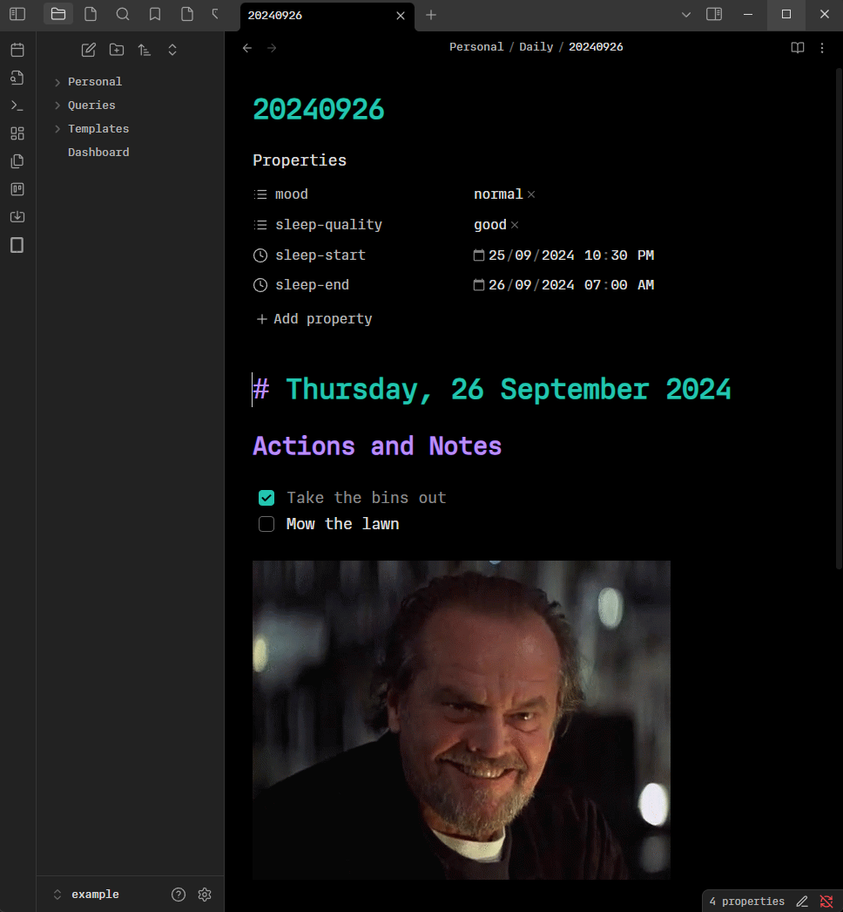
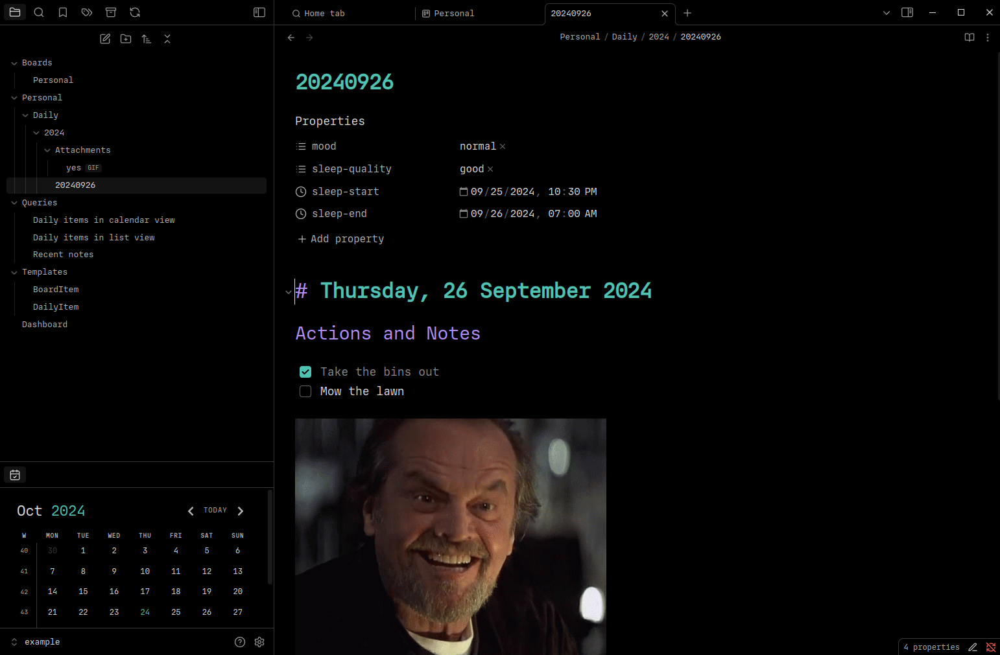
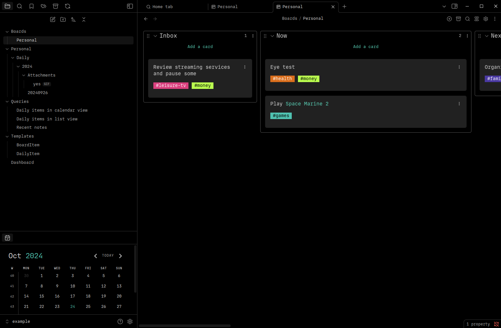

# Obsidian Configuration

My custom [Obsidian](https://obsidian.md/) configuration files ([config](config/)), example note vault ([example](example/)), management scripts ([config-backup.sh](config-backup.sh) and [config-restore.sh](config-restore.sh)), and [backup](backup/) scripts.

## Previews

Here's some previews of Obsidian running with these settings using the vault in the [example directory](example).

## Initial Setup

1. Install and open [Obsidian](https://obsidian.md/)
2. Create a new Obsidian vault named `Notes` in your user directory
3. Close Obsidian
4. Setup fonts

- Purchase your own license for the `Regular` variant of the [IO font by Mass-Driver](https://io.mass-driver.com/) and install the OTF file on your machine
- Alternatively, use your own fonts and update font names in files inside of the [config directory](config/)

5. Run the [config restore script](config-restore.sh) (use [Git Bash](https://git-scm.com/downloads) on Windows): `./config-restore.sh`
6. Open Obsidian

## Backup Config

To update the config files here from the config files in your Obsidian vault configuration directory, run the [config backup script](config-backup.sh):

`./config-backup.sh`
