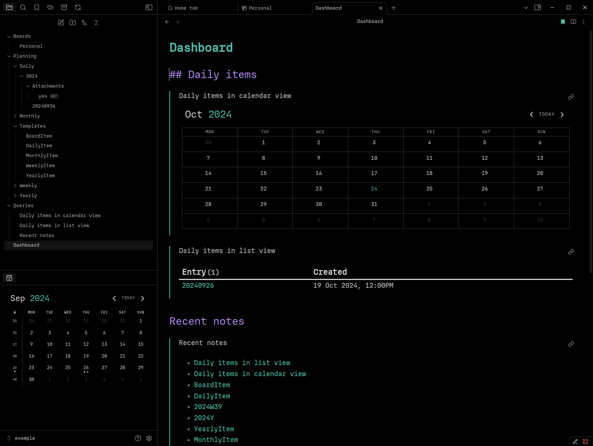

# Obsidian Configuration

The files in this folder are for customising [Obsidian](https://obsidian.md/).

## Preview

Here's some previews of Obsidian running with these settings using the vault in the [example directory](example).

## Setup

1. Install and open [Obsidian](https://obsidian.md/)
2. Setup your Obsidian Vault at `~/Notes`
3. Close Obsidian
4. Setup fonts

- Purchase your own license for the `Regular` variant of the [IO font by Mass-Driver](https://io.mass-driver.com/) and install the OTF file on your machine
- Alternatively, use your own fonts and update font names in files inside of the [config directory](config/)

5. Run the [setup script](setup.sh) (use [Git Bash](https://git-scm.com/downloads) on Windows): `bash setup.sh`
6. Open Obsidian

## Update

To update the config files here from the config files in your vault configuration directory, run the [update script](update.sh):

`bash update.sh`